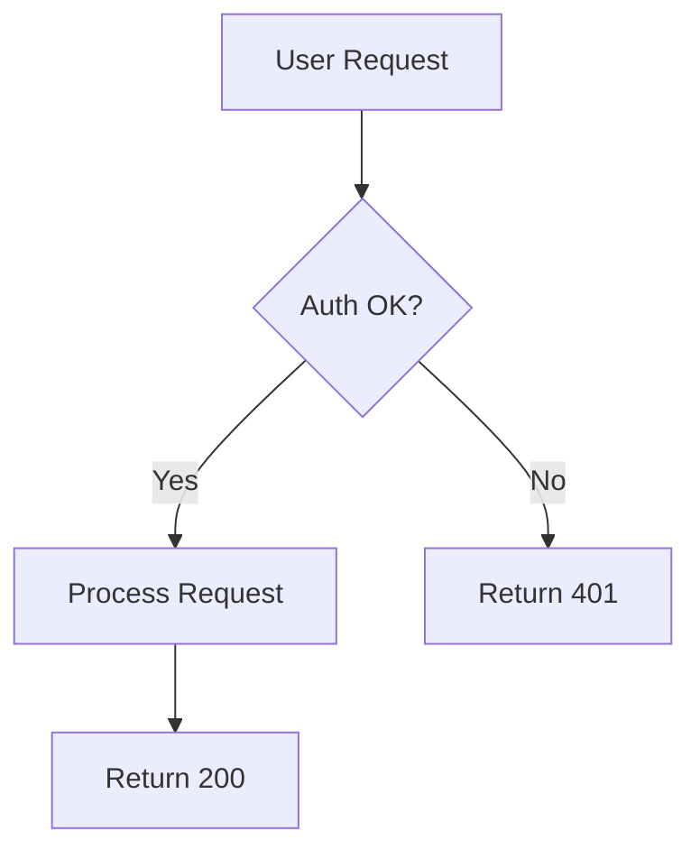
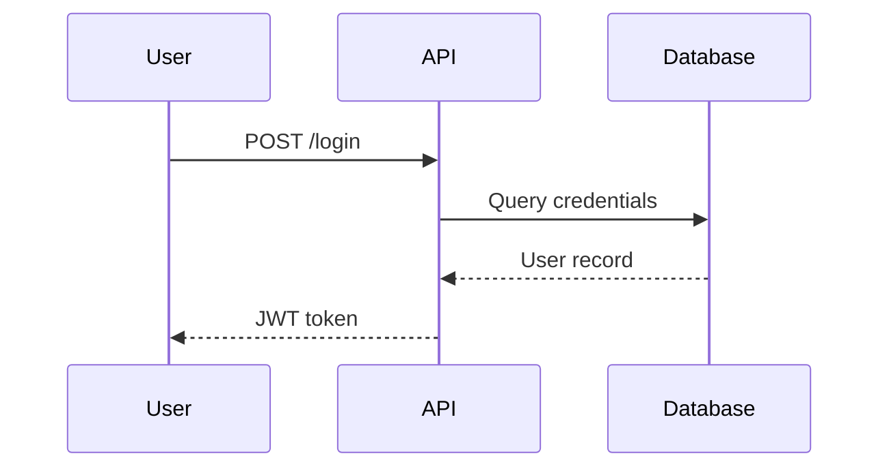

# Multi-Block Mermaid Example

This fixture contains two mermaid blocks of different diagram types.
Use it to verify that the pipeline processes multiple blocks concurrently.

```mermaid
flowchart TD
    A[User Request] --> B{Auth OK?}
    B -- Yes --> C[Process Request]
    B -- No --> D[Return 401]
    C --> E[Return 200]
```

```mermaid
sequenceDiagram
    participant U as User
    participant A as API
    participant DB as Database
    U->>A: POST /login
    A->>DB: Query credentials
    DB-->>A: User record
    A-->>U: JWT token
```
