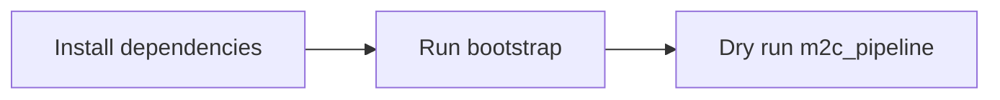

# Input And Output Boundaries

## Input

- A Markdown file with one or more fenced `mermaid` code blocks.
- Any diagram type is supported — the extractor matches any ` ```mermaid ` block regardless of diagram type. The diagram type is lowercased when stored (e.g. `sequencediagram`, `classdiagram`, `flowchart`).
- Optional CLI overrides: `--template`, `--aspect-ratio`, `--output-dir`, `--output-format` (`png` default, or `webp`), `--image-size` (`1K`/`2K`/`4K`, default `2K`), `--candidate-count` (default `1`; candidate selection only runs when the value is greater than `1`), `--webp-quality` (0–100, default 95), `--max-workers`, `--log-level`, `--translation-mode`, and `--dry-run`.

**Minimal input example** (`fixtures/minimal-input.md`):

````markdown
# Minimal Mermaid Smoke Input


````

## Offline Output (dry-run)

- Successful exit with no files written to the output directory.
- Translation logs show the generated Chiikawa-style prompt for each block.
- No cloud project or credentials required when `--translation-mode fallback` is also set.

## Live Output

Images are written to the output directory (default `./output`).

### Default: PNG output

- **Filename format**: `diagram_YYYYMMDD_HHMMSS_NN.png` where `NN` is the zero-padded block index.
- Metadata is embedded as PNG text chunks (readable with PIL or `exiftool`); no sidecar file is written.

### WebP output (`--output-format=webp`)

- **Filename format**: `diagram_YYYYMMDD_HHMMSS_NN.webp`
- Metadata is written to a sidecar file: `diagram_YYYYMMDD_HHMMSS_NN.metadata.json` (same stem, `.metadata.json` suffix).
- Sidecar write failure is treated as a storage error; the run is marked failed for that block.

### Metadata fields (both formats)

| Field | Content |
|-------|---------|
| `mermaid_source` | Original Mermaid code block |
| `image_prompt` | Final prompt sent to the image model |
| `generated_at` | ISO 8601 UTC timestamp |
| `block_index` | Block position in the source document (0-based) |
| `diagram_type` | Detected diagram type, lowercased (e.g. `flowchart`, `sequencediagram`, `classdiagram`) |
| `output_format` | `webp` or `png` |
| `image_model` | Image generation model name |
| `image_size` | Requested image resolution (`1K`, `2K`, or `4K`) |
| `image_candidate_count` | Number of candidates requested from the image model |
| `image_seed` | Seed used for image generation, if fixed |
| `translation_seed` | Seed used for Mermaid-to-prompt translation, if fixed |

### Run artifacts (`_runs/`)

Each run writes a self-contained archive under `output_dir/_runs/<run_id>/`:

```
_runs/<run_id>/
  run.json                          # run-level manifest (status, config snapshot, block summaries)
  logs/run.log                      # full run log
  input.md                          # snapshot of the input file
  blocks/<block_dir>/
    manifest.json                   # block-level manifest
    mermaid.mmd                     # extracted Mermaid source
    prompt.txt                      # final image prompt
    translation-request.txt         # Gemini translation request (vertex mode only)
    translation-response.txt        # Gemini translation response (vertex mode only)
    result.<ext>                    # hard-link or copy of the output image (webp or png)
    result.metadata.json            # hard-link of the sidecar (WebP only)
    error.txt                       # traceback on failure
```

## Failure Output

- When image generation fails for a block, the pipeline writes a recovery file to the output directory.
- **Failure filename format**: `diagram_YYYYMMDD_HHMMSS_NN_FAILED.txt`
- The file contains the original Mermaid source and the final prompt that was attempted, enough context to retry manually or adjust the prompt.
- Other blocks in the same run are not affected; the pipeline continues processing remaining blocks.
