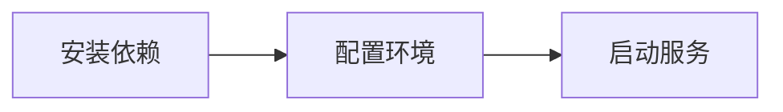
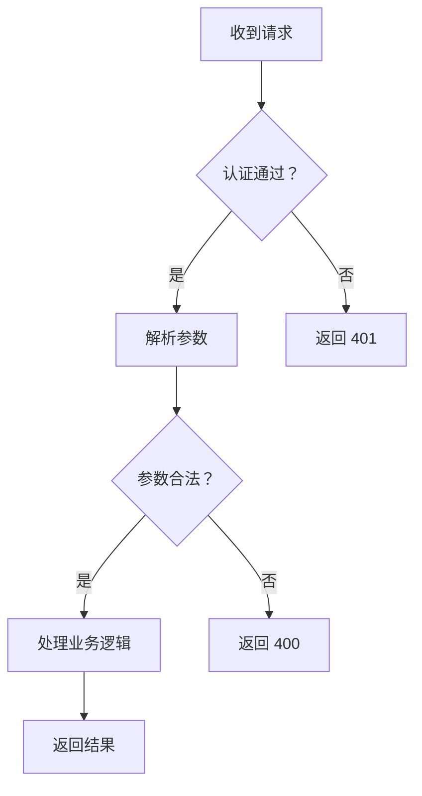

# SDK 迁移验证用例

## 用例 A：简单线性流程（预期 aspect_ratio: 1:1）

```mermaid
flowchart LR
    A[安装依赖] --> B[配置环境] --> C[启动服务]
```

## 用例 B：复杂决策分支（预期 aspect_ratio: 16:9）

```mermaid
graph TD
    START[收到请求] --> AUTH{认证通过？}
    AUTH -->|是| PARSE[解析参数]
    AUTH -->|否| REJECT[返回 401]
    PARSE --> VALIDATE{参数合法？}
    VALIDATE -->|是| PROCESS[处理业务逻辑]
    VALIDATE -->|否| ERROR[返回 400]
    PROCESS --> RESPONSE[返回结果]
```
